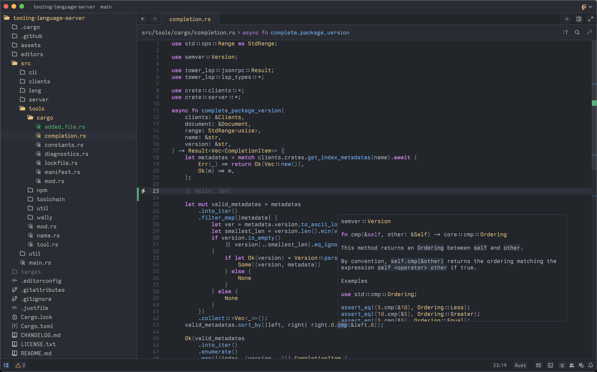

# One Dark Enhanced

Customized editor theme, loosely based on the [Zed](https://zed.dev) One Dark theme, and the [One Dark Pro](https://github.com/Binaryify/OneDark-Pro) theme for [Visual Studio Code](https://code.visualstudio.com).

## Preview

## Installation

The theme is currently available for:

- The preview version of Zed - [Installation Instructions](https://zed.dev/blog/user-themes-now-in-preview)

## Goals & Motivation

- Contrast ratio should be high, but not too high.
- Keywords are better visual anchors than symbols - and should therefore be boldened and symbols made less visible.
- Comments should be non-intrusive and not draw too much attention - they must be both optional & pleasant to read.
  They should be usable both for documentation as well as sectioning off pieces of code.
- Textual content such as variables, parameters, etc. do not have any coloring unless necessary - colors should be reserved for context and special meaning.
- Color meaning should extend _beyond_ just the editor pane - non-editor coloring such as source control / git decorations & diagnostics are also important and should not look like editor colors.
